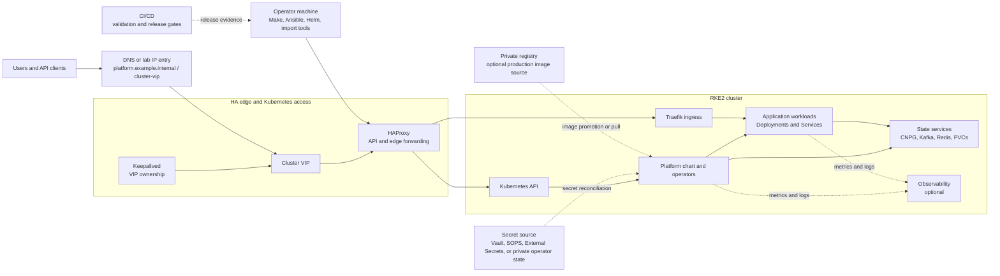
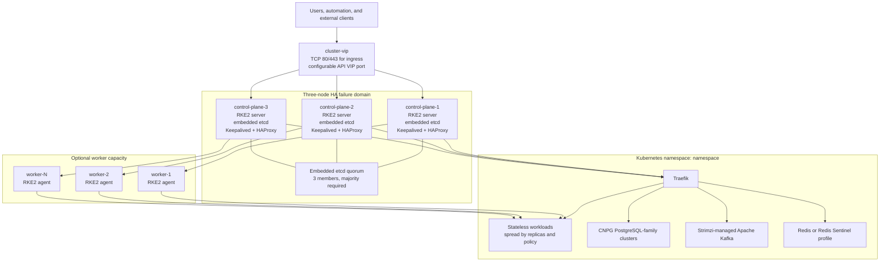
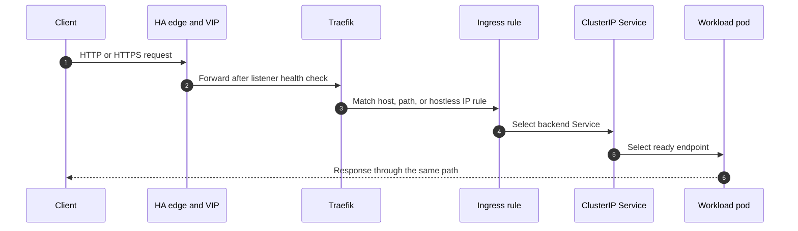
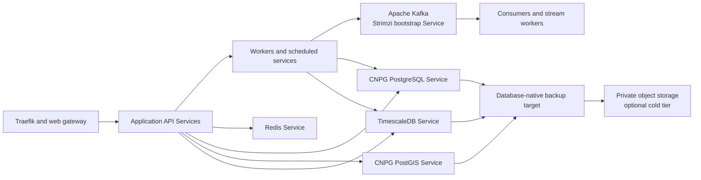
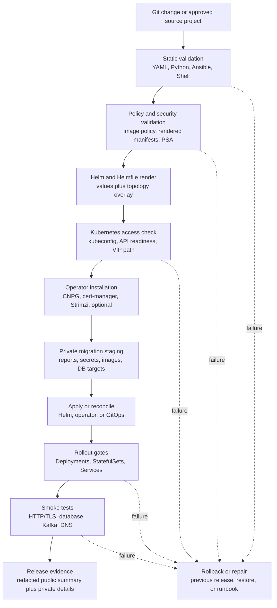
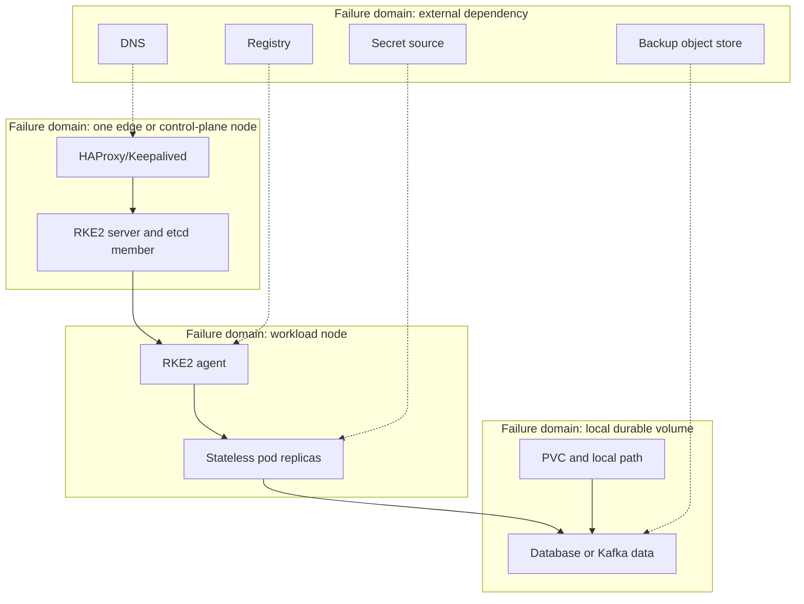

# Urban Platform Topology

This is the canonical public-safe topology reference for
`urban-platform-infra`. It describes the logical architecture, physical
deployment shape, traffic paths, stateful services, delivery flow, and failure
domains without exposing site-specific addresses or credentials.

Use placeholders such as `control-plane-1`, `cluster-vip`,
`platform.example.internal`, `namespace`, and
`private-registry.example.internal`. Replace them only in private environment
overlays or operator runbooks.

The diagrams use Mermaid so they can be reviewed in GitHub and rendered by
documentation tooling. The [High-Level Design](hld.md) and
[Low-Level Design](lld.md) use this document as their visual topology source.

## Diagram Legend

| Shape or boundary | Meaning |
|---|---|
| External actor | User, operator, CI runner, registry, DNS, or secret system outside the cluster |
| HA edge | Keepalived and HAProxy provide stable VIP behavior and health-based forwarding |
| Control plane | RKE2 server nodes and embedded etcd quorum |
| Platform plane | Traefik, operators, policy, observability, and shared services |
| Workload plane | Imported or native application Deployments, Services, and ConfigMaps |
| State plane | PostgreSQL-family databases, Kafka, Redis, PVCs, and backups |
| Dashed edge | Optional, private, or operator-controlled integration |

## 1. System Context

This is the high-level context view. A request reaches the cluster through a
stable DNS name or, in lab IP mode, a hostless ingress bound to the cluster
VIP. Control-plane operations use a separate Kubernetes API path.

## 2. Production Physical Topology

The default production contract is `three-node-ha`: three RKE2 server nodes,
an odd embedded-etcd quorum, and an HA edge on the control-plane nodes. Worker
nodes can be added through the `multi-node-ha` profile without changing the
control-plane quorum shape.

### Physical topology rules

1. Keep the RKE2 server count odd, normally three or five, so embedded etcd
   retains a majority during a node failure.
2. Keep the VIP on a network path reachable by every intended client and by
   every HA edge node. A VIP configured on the host but blocked by routing or
   firewall policy is not an available endpoint.
3. Treat `local-path` storage as node-local. A PVC bound to one node is not a
   portable replica and does not provide storage high availability.
4. Use a replicated or network-backed StorageClass for production databases,
   Kafka, and other durable state unless the platform has an explicit node
   affinity and recovery plan.
5. Add workers when workload capacity grows; do not add an even control-plane
   count merely to gain compute capacity.

## 3. Ingress Request Flow

The ingress mode determines whether routing is host-based or hostless.

| Mode | Match key | TLS expectation | Recommended use |
|---|---|---|---|
| FQDN | `platform.example.internal` | Trusted certificate or approved internal CA | Production and normal user access |
| IP hostless | `cluster-vip` with no Host requirement | Certificate must contain the IP; self-signed still needs client trust | Lab, private network, or controlled automation |
| HTTP | Path only, no TLS termination | None | Temporary lab routing and diagnostics only |

An IP address cannot receive a public ACME certificate in the same way as a
normal DNS name, and a self-signed certificate is not automatically trusted by
browsers. The platform can automate certificate creation and secret delivery,
but client trust still belongs to the operating-system or browser trust store.

## 4. Application, Data, and Messaging Flow

The application plane is stateless where possible. Database and messaging
connections stay on internal Kubernetes Services and should never depend on a
hard-coded legacy host address after import.

### Stateful service boundaries

| Boundary | Owner | Kubernetes contract | Recovery source |
|---|---|---|---|
| PostgreSQL | CloudNativePG | `Cluster` plus read-write/read-only Services | Logical dump/restore and database-native backup |
| PostGIS | CloudNativePG | PostgreSQL cluster with PostGIS image/extensions | Logical dump/restore plus extension validation |
| TimescaleDB | CloudNativePG or approved target profile | PostgreSQL-compatible Service and extension contract | Logical dump/restore plus extension validation |
| Apache Kafka | Strimzi | `Kafka`, `KafkaNodePool`, bootstrap Service | Topic/config export and approved durable volume/backup plan |
| Redis | Helm chart or approved operator profile | Service, StatefulSet, optional Sentinel | Snapshot/replication plan appropriate to cache role |

## 5. Delivery and Import Flow

This is the control-plane flow from a change in Git to a verified workload.

### Import stage boundaries

| Stage | Reads | Writes | Safe retry behavior |
|---|---|---|---|
| Prepare | Compose project and public values | Private compatibility report, target map, action plan | Rebuilds private planning outputs |
| Secrets | Approved source secret material | Kubernetes Secrets or external-secret references | Server-side apply with stable names |
| Images | Compose build contexts or registry images | Registry tags/digests or RKE2 preload archives | Digest/tag checks prevent unnecessary transfer |
| Databases | Source endpoints and approved credentials | Logical dumps and target restore state | Target map and dump checkpoints are retained privately |
| Manifests | Rendered workload model | Deployments, Services, ConfigMaps, Ingress | Server-side apply and selected-resource cleanup |
| Validate | Cluster objects and runtime endpoints | Redacted validation reports and private diagnostics | Read-only checks; failed checks identify blockers |

## 6. Failure Domains and Recovery

| Failure | Expected behavior | Operator evidence | Recovery action |
|---|---|---|---|
| One HA edge/control-plane node fails | VIP moves or remaining edge accepts traffic; etcd keeps quorum | Node health, VIP owner, API readiness, etcd health | Repair node, verify quorum, then return it to service |
| One worker fails | Replica scheduling moves ready stateless pods if capacity exists | Node conditions and pending pods | Restore capacity or reduce workload batch |
| One application pod fails | Deployment recreates it; Service removes unready endpoint | Rollout status and pod events | Inspect image, config, secret, and dependency probes |
| Local PVC host fails | State is unavailable unless replicated/backed up | PVC node affinity, CNPG/Kafka status, backup age | Restore to a replacement volume or execute stateful recovery runbook |
| Registry unavailable | Existing pinned workloads continue; new image pulls fail | Image pull events and registry probe | Use cached/preload image only for approved lab recovery |
| Secret source unavailable | Existing pods may continue; reconciliation/new rollout can fail | Secret provider status and events | Restore secret source or use approved break-glass secret path |
| DNS unavailable | Existing connections may continue; new name resolution fails | Resolver and ingress checks | Use controlled VIP fallback while DNS is repaired |

## 7. Supported Topology Profiles

The authoritative profile catalog is
[`config/deployment-topologies.yaml`](../config/deployment-topologies.yaml).

| Profile | Control plane | Workers | HA claim | Use |
|---|---:|---:|---|---|
| `single-node` | 1 | 0 | None | Development, demo, or constrained lab |
| `two-node-lab` | 1 | 1 | No embedded-etcd HA | Staging or migration rehearsal |
| `three-node-ha` | 3 | 0 initially | RKE2 server and VIP HA | Default production baseline |
| `multi-node-ha` | 3 or 5 | Scalable | Control-plane plus worker HA | Larger production capacity |

Profile selection is a contract, not a cosmetic label. The selected profile
must agree across the Ansible inventory, Helm topology values, capacity gates,
storage classes, and operational runbooks.

## 8. Network Contract

The following is a logical contract. Actual ports, firewall rules, and private
addresses belong in the environment overlay.

| Path | Source | Destination | Purpose |
|---|---|---|---|
| Edge HTTP | Client | Cluster VIP | Lab HTTP or redirect-to-HTTPS entry |
| Edge HTTPS | Client | Cluster VIP | TLS ingress entry |
| Kubernetes API | Operator and nodes | API VIP or direct server endpoint | Cluster control and reconciliation |
| Intra-cluster service | Workload pod | ClusterIP Service | Application, database, cache, and messaging traffic |
| Image pull | Node runtime | Registry or preload store | Pinned image retrieval |
| Secret sync | Operator or controller | Approved secret source | Secret reconciliation |
| Backup | Database/operator | Private object storage | Durable recovery artifacts |

NetworkPolicy should allow only the paths required by the selected services.
Ingress, egress, and service-mesh changes must be reviewed with DNS, TLS,
Kubernetes API access, and rollback behavior together.

## 9. Ownership Model

| Area | Primary owner in this repository | Environment-owned input |
|---|---|---|
| Cluster bootstrap | Ansible and Make targets | Inventory, OS access, tokens, node addresses |
| Operator lifecycle | Helmfile and operator install scripts | Chart policy, repository availability, CRD approval |
| Platform resources | Helm chart | Values overlay, replica/capacity choices |
| Imported workloads | Migration scripts | Source Compose project, service filters, secrets |
| Data migration | Migration scripts plus database operators | Credentials, dump location, restore approval |
| DNS and certificates | Ingress/TLS templates and cert-manager integration | DNS records, issuer, trust distribution |
| Backups and recovery | Policy and backup templates | Object store, retention, restore drills |
| Production evidence | CI and validation scripts | Private logs, approvals, incident/change records |

## 10. Review and Evidence Checklist

Before calling a topology production-ready, verify:

- the profile and node inventory agree;
- the API endpoint and ingress VIP are reachable from every intended client;
- HAProxy and Keepalived health checks are passing on all edge nodes;
- RKE2/etcd quorum survives one control-plane failure;
- workloads have enough replicas and scheduling capacity;
- stateful PVCs use an approved durability and recovery design;
- database, Kafka, Redis, TLS, and HTTP smoke tests pass;
- image digests, SBOM/signature evidence, and registry pull behavior are known;
- private reports, credentials, real addresses, and dumps remain outside Git;
- restore, rollback, and node-replacement drills have evidence.

Related implementation details are in the [HLD](hld.md), [LLD](lld.md),
[Deployment Topologies](deployment-topologies.md), [High Availability](high-availability.md),
[Operations](operations.md), and [Disaster Recovery](disaster-recovery.md)
documents.
